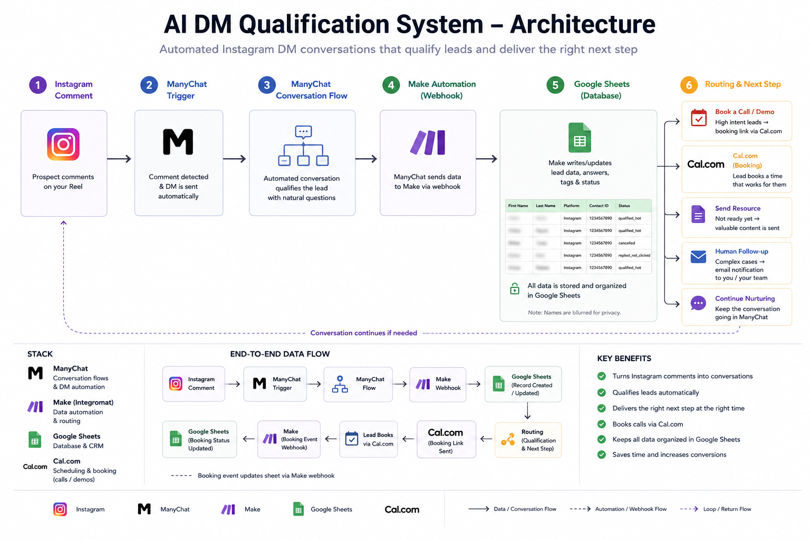
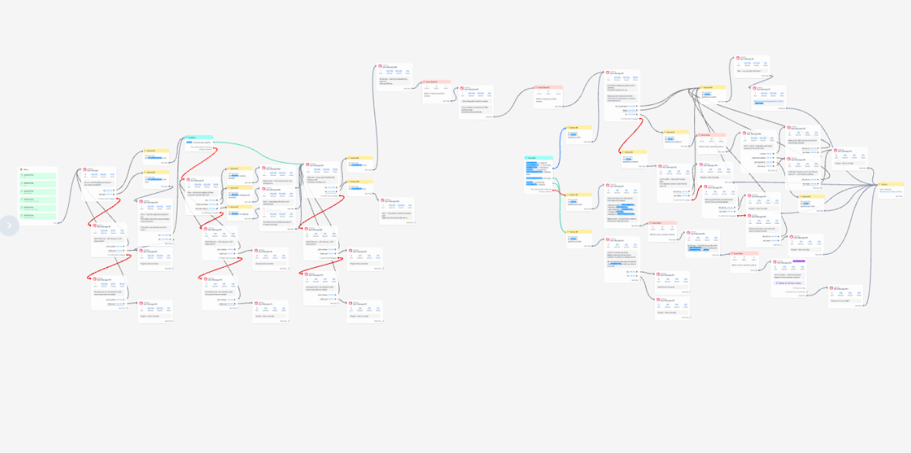
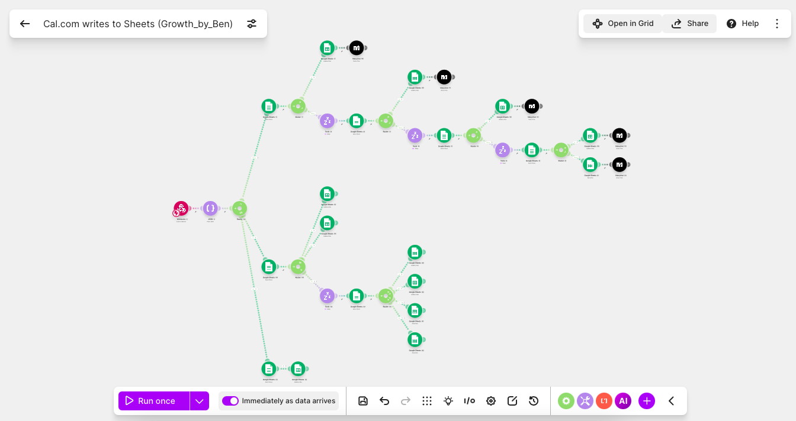
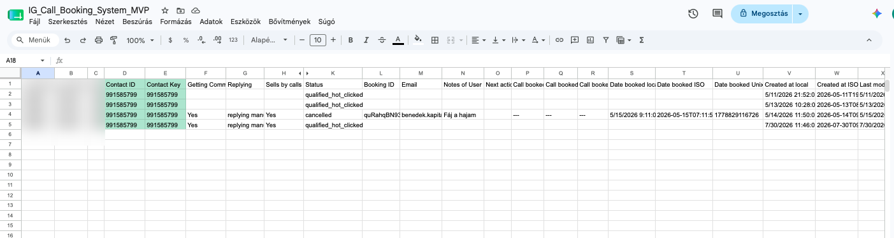

# AI DM Qualification System

> A working no-code Instagram DM qualification and call-booking prototype built with ManyChat, Make, Google Sheets and Cal.com.

## Overview
This repository documents a system designed to turn Instagram CTA engagement into structured DM conversations, qualification, routing and — where appropriate — a booked call.

## Architecture


**Stack:** ManyChat · Make · Google Sheets · Cal.com

```text
Instagram CTA → ManyChat trigger → ManyChat conversation
→ Make webhook → Google Sheets → qualification/routing
→ Cal.com booking → booking event → Make → Google Sheets update
```

Context is primarily deterministic: the trigger determines which ManyChat scenario starts. There is no separate AI context-recognition layer.

## Real implementation

### ManyChat conversation flow


### Make automation


### Google Sheets data layer


Personal names are blurred; the remaining fields are left visible to demonstrate the data structure.

## Conversation demo
- [Conversation screenshot 1](conversations/conversation-1-anonymized.jpg)
- [Conversation screenshot 2](conversations/conversation-2-anonymized.jpg)
- [Conversation screenshot 3](conversations/conversation-3-anonymized.jpg)
- [▶ Anonymized conversation video](conversations/conversation-demo-anonymized.mp4)

## Design principles
1. Conversation before conversion.
2. One useful question at a time.
3. Use known trigger/scenario context.
4. Capture useful answers as structured data.
5. Route toward the right next step.
6. Close the booking loop through Cal.com → Make → Google Sheets.

## Documentation
- [Architecture](docs/architecture.md)
- [Qualification logic](docs/qualification-logic.md)
- [Conversation design](docs/conversation-design.md)
- [Data flow](docs/data-flow.md)
- [Testing & iteration](docs/testing-and-iteration.md)
- [Lessons learned](docs/lessons-learned.md)
- [Before vs. after](docs/before-vs-after.md)
- [Future improvements](docs/future-improvements.md)
- [60-second demo script](docs/demo-video-script.md)

## Skills demonstrated
ManyChat scenario design · Make automation · webhook integration · Google Sheets data/state design · Cal.com booking integration · conversational UX · lead qualification/routing · testing and iteration.

## Privacy
Credentials, secrets and identifiable prospect data are excluded or anonymized.

## Status
**Working prototype / portfolio case study**
